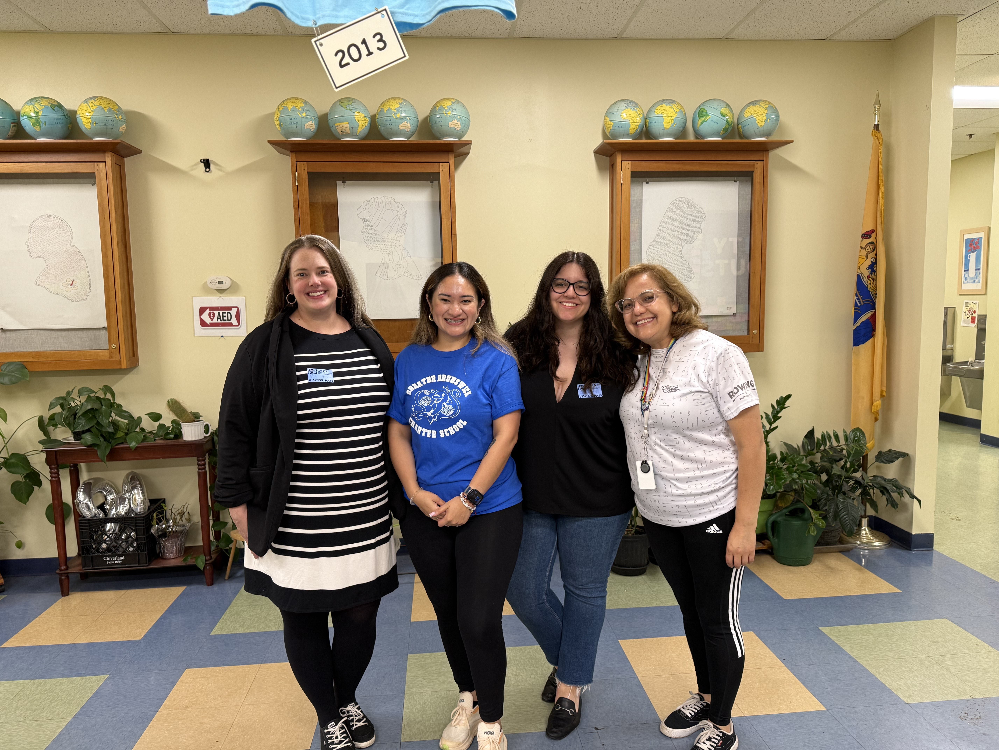

 The Spanish in Society Enrichment Program 

I co-founded and co-direct, along with [Dr. Kendra Dickinson](https://span-port.rutgers.edu/people/faculty/faculty-directory/1013-kendra-dickinson), *The Spanish in Society Enrichment Program*, an after-school initiative that promotes sociolinguistic and educational justice in the Spanish-speaking community by teaching elementary and middle school Hispanic students core sociolinguistic principles through hands-on, linguistics-based research projects. This project is fully funded and supported by the Division of Diversity, Inclusion, and Community Engagement at Rutgers University, through the IDEA Innovation Grant.

After successfully running a pilot unit on language contact in Centro Educativo Español (CENY) with first graders in New York City —the center where I work as a Spanish immersion teacher on Saturdays— we will fully implement the program in Greater Brunswick Charter School (New Brunswick, NJ) in Fall 2025. This expansion is thanks to our partnership with Daniela Suastegui, the after-school academy coordinator, and Lilia Fabila-Guilbot, the family coordinator. 

 <i> I am very excited about the full implementation of the Spanish in Society Enrichment Program and to see the continued impact this program will have on our bilingual community! </i> 

 

  

  <em>The Spanish in Society team with Daniela Suastegui and Lilia Fabila-Guilbot 
  at Greater Brunswick Charter School.</em>

